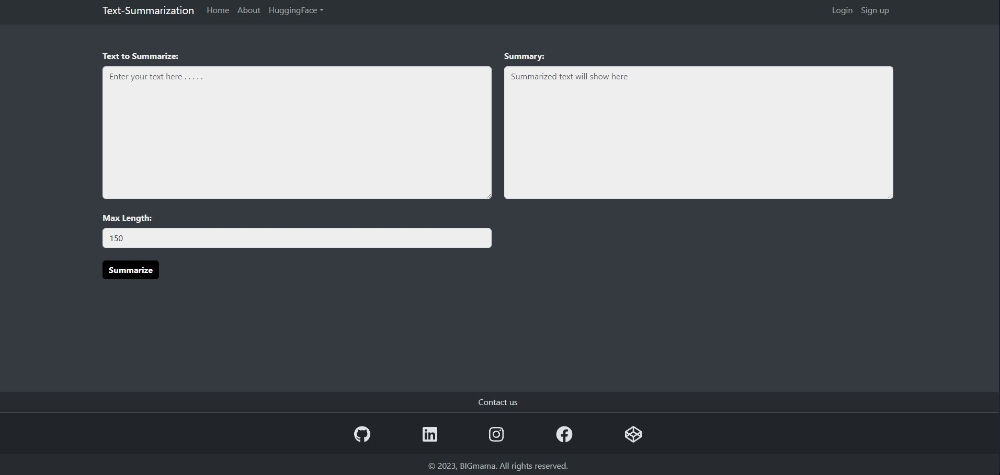

# Text-Summarization

## Overview

The Text Summarization Project is a tool that leverages advanced natural language processing for text summarization API from [HuggingFace](https://huggingface.co) to generate concise summaries from given texts. This project uses [FastAPI](https://fastapi.tiangolo.com/) for the backend, [React](https://reactjs.org/) for the frontend , [MongoDB](https://www.mongodb.com) for the database and [Docker](https://www.docker.com) for the deployment.



## Table of Contents

- [Project Structure](#project-structure)
- [API Documentation](#api-documentation)
    - [Overview](#overview)
    - [Base URL](#base-url)
    - [Endpoints](#endpoints)
- [How To Build And Run](#how-to-build-and-run)
  - [Prerequisites](#prerequisites)
  - [Build The application image](#build-the-application-image)
  - [Docker Compose](#docker-compose)
  - [Access The application](#access-the-application)
- [Future Improvements](#future-improvements)


## Project Structure

The project is composed of :

* A backend API server built with FastAPI located in the [Backend](Backend) dir.
* A frontend web app build with React and located in the [frontend](frontend) dir.

## API Documentation:

## Overview

The Text Summarization API allows you to generate concise and informative summaries from input text. The API is built using FastAPI and deployed as a Dockerized application.

## Base URL

All API requests should be made to the following base URL:

http://localhost:8000/api

## Endpoints

### 1. Summarize Text ("/summarize")
Summarize text for a given text length:

    Args:
        data (dict): The input data containing "text" and "max_length" fields.

    Returns:
        dict: A dictionary containing the summary and MongoDB document ID.
### 2. Get All Summaries ("/summaries")
 Get all summaries in the database:

    Returns:
        list: A list of summaries.
### 3. Get A Summary  ("/summary/{summary_id}")
Get a summary by ID:

    Args:
        summary_id (str): The ID of the summary.

    Returns:
        dict: A dictionary containing the summary.
### 4. Update A Summary  ("/summary/{summary_id}")
Update a summary by ID:

    Args:
        summary_id (str): The ID of the summary.
        data (dict): The data to update the summary.

    Returns:
        dict: A dictionary indicating the result of the update operation.

### 5. Delete A Summary  ("/summary/{summary_id}")
Delete a summary by ID:

    Args:
        summary_id (str): The ID of the summary.

    Returns:
        dict: A dictionary indicating the result of the delete operation.

API overview from FastAPI Swagger UI tool :


## Getting Started

### Prerequisites

Ensure you have the following installed:

- [Docker](https://www.docker.com/)
- [Docker Compose](https://docs.docker.com/compose/)

## Build The application image

1. Backend:
    ```shell script
    docker build -t fastapi ./Backend
    ```
2. Frontend:
    ```shell script
    docker build -t react ./frontend
    ```

## Docker Compose
1. Create the network:
    ```shell script
    docker-compose up
    ```

## Access The Application 

1. Access the application at : 

http://localhost:3000

2. You may view the FastAPI Swagger UI to view API routes and test CRUD operations at :

http://localhost:8000/docs

Note: If you encounter any issues running the application please contact me :)

## Future Improvements

- Add Authtication.
- Backend Unit Tests.
- Enable SSL mode for secure database.
- Switch to Typescript for better developping experince.
- Add React's Error Boundary.
- Implement React's Routing system.
- Add Toast Notifications